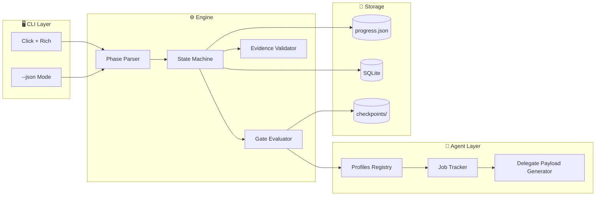

<!-- ============================================
  project-workflow-cli README
  AI-Enabled Full-Stack Engineer — FerrPOINT
  ============================================ -->

<p align="center">
  
</p>

<p align="center">
  <a href="https://github.com/FerrPOINT/project-workflow-cli/actions"></a>
  
  
  
  
</p>

<p align="center">
  <a href="#features"></a>
  <a href="#cli"></a>
  <a href="#phases"></a>
  <a href="#architecture"></a>
  <a href="#quality"></a>
</p>

---

## ✨ Features

| Feature | Description |
|---------|-------------|
| **Declarative Phases** | 42-phase workflow defined in `references/phases.yaml` — single source of truth |
| **Dual-Mode CLI** | Rich tables for humans, JSON for agents (`--json`) |
| **Gate Taxonomy** | 4 gate types: Pre-flight (PF), Revision (RV), Escalation (ES), Abort (AB) |
| **Rollback Engine** | Automatic rollback on gate failure with cycle tracking (max 3 retries) |
| **Parallel Delegation** | `delegate` / `delegate-batch` / `jobs` commands for multi-agent orchestration |
| **Evidence Tracking** | Mandatory evidence per phase: commands, screenshots, test output |
| **Context Budget** | 4-tier context discipline for LLM token management |
| **SQLite Ready** | Atomic state persistence planned (current: JSON with cleanup) |

---

## 🚀 Quick Start

```bash
git clone https://github.com/FerrPOINT/project-workflow-cli.git
cd project-workflow-cli
python3 -m venv .venv
source .venv/bin/activate
pip install -e ".[dev]"
hrflow --help
```

---

## 🖥️ CLI Commands

### Human Mode (Rich)
```bash
hrflow init TASK-123 "Implementation of auth system"
hrflow phase TASK-123 "3.0"
hrflow next TASK-123
hrflow status TASK-123
hrflow verify TASK-123
hrflow list-phases
hrflow playbook TASK-123 "7.6"
hrflow audit TASK-123
hrflow next-step TASK-123
hrflow rollback TASK-123 4.0 --reason "CriticGate BLOCKER: missing tests"
hrflow delegate TASK-123 reviewer
hrflow delegate-batch TASK-123 reviewer,qa
critics
hrflow jobs
```

### Agent Mode (JSON)
```bash
hrflow --json init TASK-123 "Auth system"
hrflow --json next-step TASK-123
hrflow --json check-env
hrflow --json playbook TASK-123 "7.6"
hrflow --json rollback TASK-123 5.5 --reason "QA FAIL"
```

---

## 📋 42-Phase Workflow

| Group | Phases | Purpose | Gates |
|-------|--------|---------|-------|
| **Preflight** | 0.0–0.9 | Tool check, task intake, setup | PF (0.0), PF (0.5) |
| **Discovery** | 1.0–1.5 | Code discovery, deep research | CG-1 (self), CG-1.5 |
| **Plan** | 2.0–3.5 | Requirements, implementation plan | CG-2, CG-3 (BLOCKER) |
| **Develop** | 4.0–4.5 | TDD implement, pre-commit review | CG-4 (self), CG-4.5 (BLOCKER) |
| **Validate** | 5.0–5.5 | Compile, test, security scan, self-test | CG-5, CG-5.5 |
| **Commit** | 6.0 | Commit + push | CG-6 |
| **Review** | 7.0–7.7 | MR draft, code review, QA, Dataflow, CriticGate | CG-7.5, CG-7.6, CG-7.7 |
| **Done** | 8.0 | Jira transition, completion | — |
| **Improve** | 9.0–10.9 | Cleanup, retro, IP generation | CG-10 (self) |

**Key Rules:**
- **Entry/Exit Ritual** — mandatory checklist before entering and after exiting each phase
- **Evidence Required** — every phase must have concrete evidence (command output, screenshot, test result)
- **No Skip Allowed** — sequential progression only, no shortcuts
- **Max 3 Feedback Cycles** — cycle 4 escalates to CTO

---

## 🏗️ Architecture



### Module Structure

```
wartz_workflow/
├── cli.py              # Click CLI with dual output (Rich + JSON)
├── config.py           # Constants, paths, API endpoints
├── state.py            # Task state (JSON + atomic SQLite)
├── phases.py           # Phase management, checklists
├── schema.py           # YAML → dataclasses parser
├── engine.py           # Phase execution engine
├── verify.py           # verify-suite, .gitignore, tokens
├── jira_gitlab.py      # Jira REST + GitLab API integration
├── profiles.py         # Agent profile registry
├── jobs.py             # Job tracking for background tasks
├── rollback.py         # Rollback engine with cycle tracking
└── references/
    └── phases.yaml     # Declarative 42-phase schema

tests/
├── test_cli_integration.py
├── test_jobs.py
├── test_phases.py
├── test_profiles.py
├── test_rollback.py
├── test_state.py
└── test_verify.py
```

---

## 🛡️ Quality Bar

| Metric | Target | Current |
|--------|--------|---------|
| Test Coverage | ≥ 80% | 47% |
| Passing Tests | 58/58 | ✅ |
| Lint | ruff + mypy | ✅ |
| CI Pipeline | pytest + ruff + mypy | ✅ |
| Security Scan | Semgrep, Bandit | Planned |

```bash
# Run tests with coverage
pytest tests/ -v --cov=wartz_workflow --cov-report=term

# Run linting
ruff check wartz_workflow/
mypy wartz_workflow/
```

---

## 🎯 Roadmap

- [x] 26 → 42 phase transition
- [x] Gate taxonomy (PF, RV, ES, AB)
- [x] Rollback engine with cycle tracking
- [x] Parallel agent delegation (delegate / delegate-batch / jobs)
- [ ] SQLite atomic state persistence
- [ ] Evidence validator with YAML rules
- [ ] Jira transition integration
- [ ] GitLab MR state checks
- [ ] Auto-delegate payload generation
- [ ] Audit report command (`hrflow audit`)
- [ ] Coverage → 80%

---

## 📫 Links

<p align="center">
  <a href="https://github.com/FerrPOINT"></a>
  <a href="mailto:ferruspoint@mail.ru"></a>
  <a href="https://t.me/ferrpoint"></a>
</p>

<p align="center">
  
</p>
