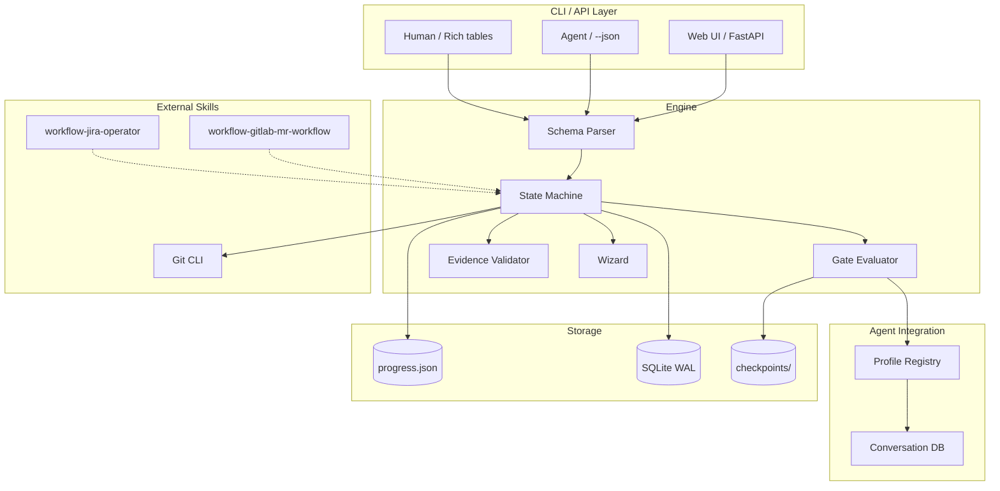

<!-- project-workflow-cli README — v4.0 2026 -->

<p align="center">
  
</p>

<p align="center">
  
  
  
  
  
</p>

<p align="center">
  <a href="#features"></a>
  <a href="#-cli-commands"></a>
  <a href="#-30-phase-workflow"></a>
  <a href="#-architecture"></a>
  <a href="#-ui"></a>
</p>

---

<a name="features"></a>
## ✨ Features

| Feature | Description |
|---------|-------------|
| **Declarative Phases** | 30-phase workflow defined in `references/phases.yaml` — single source of truth |
| **Dual-Mode CLI** | Rich tables for humans, structured JSON for agents (`--json`) |
| **State-Driven** | Workflow tracks task state, not job queue. Agent reports → phase advances or returns feedback |
| **Web UI** | FastAPI-based UI on unique port — view phases, tasks, current state |
| **Conversation Tracking** | All agent reports stored in SQLite per task, per phase |
| **Gate Taxonomy** | Gates: blocker (hard stop), delegated (agent assigned), parallel (multi-track) |
| **Wizard Mode** | Phase-by-phase questionnaire: agent reports, CLI evaluates pass/fail |
| **Rollback Engine** | Automatic rollback on gate failure with cycle tracking (max 3 retries) |
| **Evidence Tracking** | Mandatory evidence per phase: commands, test results, logs |
| **Context Budget** | 4-tier discipline for LLM context window management |
| **SQLite State** | Atomic writes in WAL mode for progress tracking |

---

## 📋 Requirements

- Python 3.11+
- Git
- Jira access token (`JIRA_ACCESS_TOKEN`) — optional, for integration
- GitLab access token (`GLAB_TOKEN`) — optional, for integration

---

## 🚀 Quick Start

```bash
git clone https://github.com/FerrPOINT/project-workflow-cli.git
cd project-workflow-cli
python3 -m venv .venv
source .venv/bin/activate
pip install -e ".[dev]"
hrflow --help
```

---

<a name="-cli-commands"></a>
## 🖥️ CLI Commands

### Human Mode (Rich)
```bash
hrflow init TASK-123 "Implementation of auth system"
hrflow phase TASK-123 "3"
hrflow next TASK-123
hrflow status TASK-123
hrflow verify TASK-123
hrflow list-phases
hrflow playbook TASK-123 "7.6"
hrflow audit TASK-123
hrflow next-step TASK-123
hrflow rollback TASK-123 4 --reason "CriticGate BLOCKER: missing tests"
hrflow wizard TASK-123        # Phase-by-phase questionnaire
hrflow ui                     # Launch Web UI
```

### Agent Mode (JSON)
```bash
hrflow --json init TASK-123 "Auth system"
hrflow --json next-step TASK-123
hrflow --json check-env
hrflow --json playbook TASK-123 "7.6"
hrflow --json rollback TASK-123 5 --reason "QA FAIL"
hrflow --json wizard TASK-123 --report "сделал X, проверил Y"
```

---

<a name="-30-phase-workflow"></a>
## 📋 30-Phase Workflow

| Group | Phases | Purpose | Gates |
|-------|--------|---------|-------|
| **Setup** | -1, 0.0a–0.9 | Tool check, task intake, setup | blocker (-1), delegated (0.6) |
| **Research** | 0.6, 1–2 | Code discovery, deep research | delegated (0.6), blocker (2) |
| **Plan** | 3–3.5 | Requirements, implementation plan | blocker (3) |
| **Implement** | 4–5.5 | TDD, pre-commit review, self-test | blocker (4.5), delegated (5) |
| **Deliver** | 6–7.7 | Commit, MR, code review, QA, Dataflow | delegated (7.5, 7.6), blocker (7.7) |
| **Closure** | 8–10 | Done, cleanup, retro, improvement | blocker (8) |

**Core rules:**
- **Entry/Exit Ritual** — mandatory checklist at each phase boundary
- **Evidence Required** — concrete proof required (command output, test result, log file)
- **No Skip Allowed** — sequential execution only, no shortcuts
- **Max 3 Feedback Cycles** — cycle 4 escalates to human review

---

### Full Phase Map

```mermaid
%%{init: {'theme': 'dark', 'themeVariables': { 'primaryColor': '#06B6D4', 'edgeLabelBackground':'#1E293B', 'tertiaryColor': '#fff'}}}%%
flowchart TD
    subgraph G0["🚀 Setup"]
        p_1[-1 Intake] --> p00a[0.0a Verify]
        p00a --> p001[0.01 Setup]
        p001 --> p001a[0.01a Docs]
        p001a --> p001b[0.01b .gitignore]
        p001b --> p0[0 Token]
        p0 --> p000[0.00 Git ID]
        p000 --> p0000[0.000 Sync]
        p0000 --> p07[0.7 Repos]
        p07 --> p09[0.9 Critic]
        p09 --> p05[0.5 Jira]
        p05 --> p06[0.6 Researcher]
    end

    subgraph G1["🔍 Research"]
        p1[1 Context] --> p15[1.5 Deep]
        p15 --> p2[2 Discovery]
    end

    subgraph G2["📐 Plan"]
        p3[3 Plan] --> p35[3.5 BLOCKER]
    end

    subgraph G4["💻 Implement"]
        p4[4 Branch] --> p45[4.5 BLOCKER]
        p45 --> p5[5 TDD]
        p5 --> p55[5.5 Self-Test]
    end

    subgraph G6["📦 Deliver"]
        p6[6 Commit] --> p7[7 MR Draft]
        p7 --> p75[7.5 Review]
        p75 --> p76[7.6 QA]
        p76 --> p76r[7.6R Dataflow]
        p76r --> p77[7.7 BLOCKER]
    end

    subgraph G8["✅ Closure"]
        p8[8 Done] --> p9[9 Cleanup]
        p9 --> p10[10 Retro]
    end

    p06 --> p1
    p2 --> p3
    p35 --> p4
    p55 --> p6
    p77 --> p8

    classDef setup fill:#06B6D4,stroke:#0891B2,stroke-width:2px,color:#0B0F1A
    classDef research fill:#3B82F6,stroke:#2563EB,stroke-width:2px,color:#0B0F1A
    classDef plan fill:#F59E0B,stroke:#D97706,stroke-width:2px,color:#0B0F1A
    classDef impl fill:#EF4444,stroke:#DC2626,stroke-width:2px,color:#fff
    classDef deliver fill:#10B981,stroke:#059669,stroke-width:2px,color:#0B0F1A
    classDef closure fill:#14B8A6,stroke:#0D9488,stroke-width:2px,color:#0B0F1A

    class p_1,p00a,p001,p001a,p001b,p0,p000,p0000,p07,p09,p05,p06 setup
    class p1,p15,p2 research
    class p3,p35 plan
    class p4,p45,p5,p55 impl
    class p6,p7,p75,p76,p76r,p77 deliver
    class p8,p9,p10 closure
```



---

### Color Map

| Group | Hex | Emoji |
|-------|-----|-------|
| Setup | `#06B6D4` | 🚀 |
| Research | `#3B82F6` | 🔍 |
| Plan | `#F59E0B` | 📐 |
| Implement | `#EF4444` | 💻 |
| Deliver | `#10B981` | 📦 |
| Closure | `#14B8A6` | ✅ |

---

### Gate Legend

| Gate | Emoji | Meaning | FAIL Action |
|------|-------|---------|-------------|
| blocker | 🔴 | Hard stop, human required | Rollback to target phase |
| delegated | 🟡 | Assigned to specific agent | Agent completes, reports back |
| parallel | 🟢 | Multi-track, can run concurrently | Merge before next phase |

---

<a name="-architecture"></a>
## 🏗️ Architecture



### Module Layout

```
wartz_workflow/
├── cli/
│   ├── core.py           # Main CLI entry (Click + Rich)
│   ├── init.py           # Task initialization
│   ├── phase.py          # Phase commands
│   ├── status.py         # Status + note tracking
│   ├── workflow.py       # Merge-check, rollback
│   ├── delegate.py       # Agent delegation
│   ├── rollback.py       # Rollback engine
│   └── ui.py             # Web UI launcher
├── adapters/
│   ├── ports.py           # Port interfaces (JiraPort, GitLabPort)
│   ├── http/
│   │   ├── jira.py       # Jira adapter
│   │   └── gitlab.py     # GitLab adapter
│   └── db/
│       └── __init__.py    # SQLite state adapter
├── api/
│   └── routers/
│       ├── phases.py      # FastAPI phase routes
│       └── wizard.py      # FastAPI wizard routes
├── engine.py             # Phase execution + gate checks
├── schema.py             # YAML → dataclasses parser
├── phases.py             # Phase management
├── state.py              # State persistence (JSON → SQLite)
├── wizard.py             # Wizard questionnaire engine
├── jobs.py               # Background job tracking (FS-based)
├── conversation.py       # SQLite conversation store
├── profiles.py           # Agent profile registry
├── rollback.py           # Rollback with cycle tracking
├── verify.py             # verify-suite, env checks
├── task_validator.py     # Task key validation
├── config.py             # Constants, paths, PHASE_ORDER
├── ui.py                 # FastAPI Web UI (inline templates)
└── references/
    └── phases.yaml         # Declarative 30-phase schema

tests/
├── test_cli_integration.py
├── test_jobs.py
├── test_phases.py
├── test_profiles.py
├── test_rollback.py
├── test_state.py
├── test_verify.py
├── test_adapters.py
├── test_ui.py
└── test_ui_wizard.py
```

---

<a name="-ui"></a>
## 🌐 Web UI

```bash
# Launch UI server
hrflow ui
# or
python -m wartz_workflow.ui --port 8811 --host 0.0.0.0
```

**Pages:**
- **Dashboard** — task count, phase stats, blocker count
- **Phases** — all 30 phases with groups, gate badges, timeline
- **Tasks** — task history from conversation DB
- **Config** — current configuration, key patterns
- **Wizard** — phase questionnaire per task

**Access:** `http://<host>:8811`

---

<a name="-quality-bar"></a>
## 🛡️ Quality Bar

| Metric | Target | Current |
|--------|--------|---------|
| Test Coverage | ≥ 80% | 87% |
| Passing Tests | 126/126 | ✅ |
| Lint | ruff + mypy | ✅ |
| CI Pipeline | pytest + ruff + mypy | ✅ |

```bash
# Run tests with coverage
pytest tests/ -v --cov=wartz_workflow --cov-report=term

# Run linting
ruff check wartz_workflow/
mypy wartz_workflow/
```

---

## 🎯 Roadmap

- [x] 30 declarative phases in YAML
- [x] Gate taxonomy (blocker / delegated / parallel)
- [x] Rollback engine with cycle tracking
- [x] Wizard mode (questionnaire + evaluation)
- [x] Web UI (FastAPI + inline templates)
- [x] SQLite conversation tracking
- [x] 126 tests, 87% coverage
- [x] Dual-mode CLI (Rich + JSON)
- [ ] Full SQLite state migration (WAL mode)
- [ ] Jira transition integration via external skill
- [ ] GitLab MR state checks via external skill
- [ ] Audit report generation
- [ ] Multi-agent parallel execution tracking

---

## 📫 Links

<p align="center">
  <a href="https://github.com/FerrPOINT"></a>
  <a href="https://t.me/ferrpoint"></a>
</p>

<p align="center">
  
</p>

---

<details>
<summary><b>Design Decisions</b></summary>

- **Python 3.11** — practical standard for CLI tools and backend automation. Click + Rich provide production-ready interfaces without overengineering.
- **YAML as single source of truth** — 30 phases defined declaratively, allowing workflow changes without code modifications.
- **Dual-mode CLI** — one command works for humans (Rich tables) and agents (JSON). Critical for AI-agent workflows.
- **State-driven, not API-driven** — workflow tracks phase state per task. Agent reports results, CLI evaluates gates. No job queue abstraction.
- **Gate taxonomy** — three gate types with strict rules: blocker (hard stop), delegated (agent assigned), parallel (multi-track).
- **Evidence tracking** — every phase requires concrete proof (command output, test result, or log file). Prevents "looks fine" assumptions.
- **Native Hermes integration** — uses `delegate_task` directly instead of external frameworks (CrewAI / OpenAI Swarm) for full payload control.
- **Web UI** — minimal FastAPI with inline templates. No external template engine dependency.

</details>
