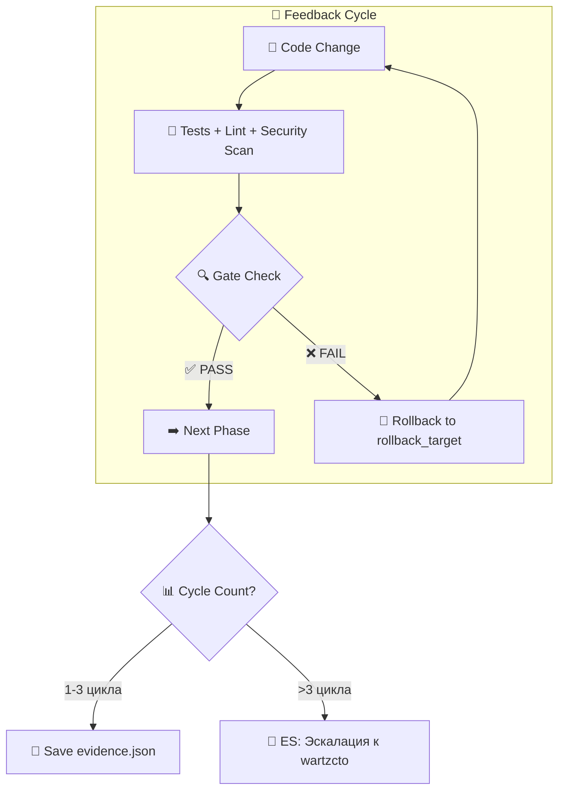
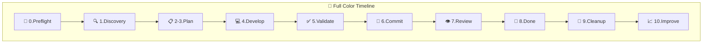
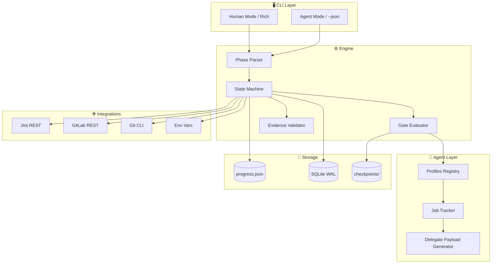
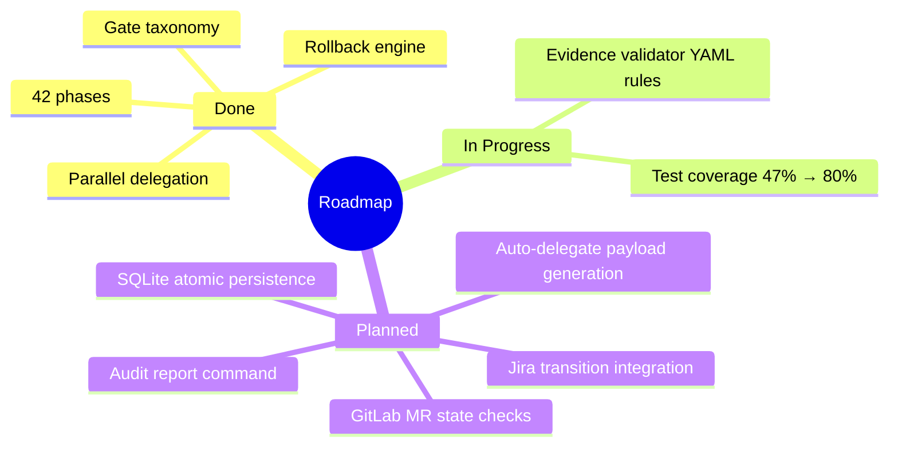

<!-- project-workflow-cli README — v2.0 2026 -->

<p align="center">
  
</p>

<p align="center">
  <a href="https://github.com/FerrPOINT/project-workflow-cli/actions"></a>
  
  
  
  
</p>

<p align="center">
  <a href="#features"></a>
  <a href="#cli"></a>
  <a href="#phases"></a>
  <a href="#architecture"></a>
  <a href="#quality"></a>
</p>

---

## Позиционирование

CLI-инструмент для **жёсткого пофазового управления задачами разработки**. Каждая задача проходит через 42 декларативно описанные фазы (YAML), с **mandatory evidence** на каждом шаге. Поддерживает rollback-циклы, параллельное делегирование sub-агентам и dual-mode вывод.

**Фокус:** контролируемый AI-agent workflow · декларативные фазы · evidence tracking · gate taxonomy · production-ready CLI.

---

## ✨ Features

| Feature | Description |
|---------|-------------|
| **Declarative Phases** | 42-phase workflow в `references/phases.yaml` — единый источник истины |
| **Dual-Mode CLI** | Rich tables для людей, JSON для агентов (`--json`) |
| **Gate Taxonomy** | 4 типа: Pre-flight (PF), Revision (RV), Escalation (ES), Abort (AB) |
| **Rollback Engine** | Автоматический откат при gate failure с cycle tracking (max 3 retries) |
| **Parallel Delegation** | `delegate` / `delegate-batch` / `jobs` для multi-agent orchestration |
| **Evidence Tracking** | Обязательное подтверждение на каждой фазе: команды, скриншоты, тесты |
| **Context Budget** | 4-tier дисциплина для управления LLM контекстом |
| **SQLite Ready** | Atomic state persistence (планируется) |

---

## 🚀 Quick Start

```bash
git clone https://github.com/FerrPOINT/project-workflow-cli.git
cd project-workflow-cli
python3 -m venv .venv
source .venv/bin/activate
pip install -e ".[dev]"
hrflow --help
```

---

## 🖥️ CLI Commands

### Human Mode (Rich)
```bash
hrflow init TASK-123 "Implementation of auth system"
hrflow phase TASK-123 "3.0"
hrflow next TASK-123
hrflow status TASK-123
hrflow verify TASK-123
hrflow list-phases
hrflow playbook TASK-123 "7.6"
hrflow audit TASK-123
hrflow next-step TASK-123
hrflow rollback TASK-123 4.0 --reason "CriticGate BLOCKER: missing tests"
hrflow delegate TASK-123 reviewer
hrflow delegate-batch TASK-123 reviewer,qa
hrflow jobs
```

### Agent Mode (JSON)
```bash
hrflow --json init TASK-123 "Auth system"
hrflow --json next-step TASK-123
hrflow --json check-env
hrflow --json playbook TASK-123 "7.6"
hrflow --json rollback TASK-123 5.5 --reason "QA FAIL"
```

---

## 📋 42-Phase Workflow

| Group | Phases | Purpose | Gates |
|-------|--------|---------|-------|
| **Preflight** | 0.0–0.9 | Tool check, task intake, setup | PF (0.0), PF (0.5) |
| **Discovery** | 1.0–1.5 | Code discovery, deep research | CG-1 (self), CG-1.5 |
| **Plan** | 2.0–3.5 | Requirements, implementation plan | CG-2, CG-3 (BLOCKER) |
| **Develop** | 4.0–4.5 | TDD implement, pre-commit review | CG-4 (self), CG-4.5 (BLOCKER) |
| **Validate** | 5.0–5.5 | Compile, test, security scan, self-test | CG-5, CG-5.5 |
| **Commit** | 6.0 | Commit + push | CG-6 |
| **Review** | 7.0–7.7 | MR draft, code review, QA, Dataflow, CriticGate | CG-7.5, CG-7.6, CG-7.7 |
| **Done** | 8.0 | Jira transition, completion | — |
| **Improve** | 9.0–10.9 | Cleanup, retro, IP generation | CG-10 (self) |

**Ключевые правила:**
- **Entry/Exit Ritual** — обязательный чеклист перед входом и после выхода из каждой фазы
- **Evidence Required** — каждая фаза требует concrete evidence (вывод команды, скриншот, результат теста)
- **No Skip Allowed** — только последовательное прохождение, нет shortcuts
- **Max 3 Feedback Cycles** — cycle 4 эскалирует к CTO

### 🗺️ Полная карта 42 фаз

```mermaid
%%{init: {'theme': 'dark', 'themeVariables': { 'primaryColor': '#06B6D4', 'edgeLabelBackground':'#1E293B', 'tertiaryColor': '#fff'}}}%%
flowchart TD
    classDef preflight fill:#06B6D4,stroke:#0891B2,stroke-width:2px,color:#0B0F1A
    classDef discovery fill:#3B82F6,stroke:#2563EB,stroke-width:2px,color:#0B0F1A
    classDef plan fill:#F59E0B,stroke:#D97706,stroke-width:2px,color:#0B0F1A
    classDef dev fill:#EF4444,stroke:#DC2626,stroke-width:2px,color:#fff
    classDef validate fill:#10B981,stroke:#059669,stroke-width:2px,color:#0B0F1A
    classDef commit fill:#6366F1,stroke:#4F46E5,stroke-width:2px,color:#fff
    classDef review fill:#8B5CF6,stroke:#7C3AED,stroke-width:2px,color:#fff
    classDef done fill:#14B8A6,stroke:#0D9488,stroke-width:2px,color:#0B0F1A
    classDef improve fill:#EC4899,stroke:#DB2777,stroke-width:2px,color:#fff
    classDef gate fill:#1E293B,stroke:#F59E0B,stroke-width:2px,color:#F59E0B,stroke-dasharray: 5 5

    subgraph G0["🚀 GROUP 0 — Preflight"]
        p00[0.0 Tool Check] --> p06[0.6 Team Setup]
        p06 --> p07[0.7 Repos Sync]
        p07 --> p08[0.8 Wiki Sync]
        p08 --> p09["0.9 PF: CG-0.9"]
        p09 --> p05["0.5 PF: Jira → В работе"]
    end

    subgraph G1["🔍 GROUP 1 — Discovery"]
        p10[1.0 Preflight] --> p11[1.1 Code Discovery]
        p11 --> p12[1.2 Git History]
        p12 --> p15["1.5 PF: Deep Research"]
        p15 --> p13[1.3 Open MRs Check]
        p13 --> p14[1.4 Unit Test Draft]
    end

    subgraph G2["📋 GROUP 2-3 — Plan"]
        p20[2.0 Dataflow Mapping]
        p21[2.1 Code Archaeology]
        p22[2.2 API Verification]
        p23[2.3 Edge Cases]
        p24[2.4 Test Coverage Analysis]
        p25[2.5 MR Conflicts]
        p30[3.0 Plan: Files, Methods, SQL]
        p32[3.2 External Deps + Mock/Seed]
        p35["3.5 RV: CG-PrePlan BLOCKER"]
        p20 --> p30
        p21 --> p30
        p22 --> p32
        p23 --> p32
        p24 --> p32
        p25 --> p30
        p30 --> p32
        p32 --> p35
    end

    subgraph G4["💻 GROUP 4 — Develop"]
        p40["4.0 🌿 Create Branch"] --> p41["4.1 Write Tests (RED)"]
        p41 --> p42["4.2 Implement Code (GREEN)"]
        p42 --> p43["4.3 Refactor"]
        p43 --> p44["4.4 TypeScript/Lint Check"]
        p44 --> p45["4.5 RV: CG-PreCommit BLOCKER"]
    end

    subgraph G5["✅ GROUP 5 — Validate"]
        p50["5.0 Compilation Gate"] --> p51["5.1 Security Scan"]
        p51 --> p52["5.2 Test Gate"]
        p52 --> p53["5.3 Diff Sanity"]
        p53 --> p54["5.4 Lint Gate"]
        p54 --> p55["5.5 RV: Self-Test Gate"]
    end

    subgraph G6["💾 GROUP 6 — Commit"]
        p60["6.0 Commit + Push"] --> p61["6.1 CG-6"]
    end

    subgraph G7["👁️ GROUP 7 — Review"]
        p70["7.0 MR Draft"] --> p71["7.1 Pipeline Check"]
        p71 --> p72["7.2 Jira Link Update"]
        p72 --> p75["7.5 RV: Code Review"]
        p75 --> p76["7.6 RV: QA Test"]
        p76 --> p76r["7.6.R Dataflow Verification"]
        p76r --> p77["7.7 RV: CG-PostQA"]
    end

    subgraph G8["🏁 GROUP 8 — Done"]
        p80["8.0 Jira → Выполнено"]
        p81["8.1 Completion Report"]
        p80 --> p81
    end

    subgraph G9["🧹 GROUP 9 — Cleanup"]
        p90["9.0 Checkout Develop"]
        p91["9.1 Delete Branch"]
        p92["9.2 Reset --hard"]
        p90 --> p91 --> p92
    end

    subgraph G10["📈 GROUP 10 — Improvement"]
        p100["10.0 Retro"] --> p101["10.1 CG Audit"]
        p101 --> p102["10.2 Generate IPs"]
        p102 --> p103["10.3 Patch Skills"]
        p103 --> p104["10.4 Bump Version"]
    end

    p05 --> p10
    p14 --> p20
    p35 --> p40
    p45 --> p50
    p55 --> p60
    p61 --> p70
    p77 --> p80
    p81 --> p90
    p92 --> p100

    class p00,p06,p07,p08,p09,p05 preflight
    class p10,p11,p12,p13,p14,p15 discovery
    class p20,p21,p22,p23,p24,p25,p30,p32,p35 plan
    class p40,p41,p42,p43,p44,p45 dev
    class p50,p51,p52,p53,p54,p55 validate
    class p60,p61 commit
    class p70,p71,p72,p75,p76,p76r,p77 review
    class p80,p81 done
    class p90,p91,p92 improve
    class p100,p101,p102,p103,p104 improve
```



---

## 🏗️ Architecture

### 🎨 Цветовая карта групп

| 🎨 Цвет | Эмодзи | Группа | Фазы | Описание |
|---------|--------|--------|------|----------|
| 🔵 Cyan | 🚀 | **Preflight** | 0.0–0.9 | Tool check, task intake, setup |
| 🔵 Blue | 🔍 | **Discovery** | 1.0–1.5 | Code discovery, deep research |
| 🟡 Amber | 📋 | **Plan** | 2.0–3.5 | Requirements, implementation plan |
| 🔴 Red | 💻 | **Develop** | 4.0–4.5 | TDD implement, pre-commit review |
| 🟢 Emerald | ✅ | **Validate** | 5.0–5.5 | Compile, test, security, self-test |
| 💜 Indigo | 💾 | **Commit** | 6.0 | Commit + push |
| 🟣 Purple | 👁️ | **Review** | 7.0–7.7 | MR draft, code review, QA, Dataflow |
| 🟢 Teal | 🏁 | **Done** | 8.0 | Jira transition, completion |
| 🩷 Pink | 🧹 | **Cleanup** | 9.0 | Git cleanup |
| 🩷 Pink | 📈 | **Improve** | 10.0–10.9 | Retro, IP generation |

### 🚦 Gate Type Legend

| Gate | Символ | Когда запускается | Результат FAIL |
|------|--------|-------------------|----------------|
| **PF** 🔵 | Pre-flight Gate | Перед входом в фазу | ❌ Нельзя войти в фазу |
| **RV** 🟡 | Revision Gate | После завершения фазы | 🔄 Откат к `rollback_target` |
| **ES** 🟣 | Escalation Gate | Ситуационный (cycle >3) | 👤 Эскалация к человеку |
| **AB** 🔴 | Abort Gate | Критическая ошибка | 🛑 Прерывание workflow |

### 🔄 Feedback Loop Architecture



### 📊 Phase Progress Tracker (пример)

| Phase | Статус | 🔄 Попытки | ⏱️ Время | 📝 Evidence |
|-------|--------|-----------|----------|------------|
| 0.0 Tool Check | ✅ | 1/3 | ~1 min | `wartz-jira me` OK |
| 0.6 Team Setup | ✅ | 1/3 | ~2 min | researcher delegate output |
| 0.7 Repos Sync | ✅ | 1/3 | ~3 min | `git status --short` empty |
| 0.8 Wiki Sync | ✅ | 1/3 | ~1 min | `git log HEAD..origin/develop` |
| 0.9 CG-0.9 | 🟡 | 1/3 | ~30 sec | WARN: Wiki не обновлена |
| **1.0 Preflight** | ✅ | **1/3** | **~5 min** | **CLAUDE.md прочитан** |
| 3.0 Plan | ✅ | **2/3** | **~8 min** | CG-3 BLOCKER → fix → PASS |
| **4.0 Implement** | ⏳ | — | — | branch создан, TDD RED |

### 🌈 Full Phase ASCII Timeline

```
🚀 PREFLIGHT          🔍 DISCOVERY          📋 PLAN              💻 DEVELOP
│                      │                    │                   │
├─ 0.0 Tool Check      ├─ 1.0 Preflight     ├─ 2.0 Dataflow     ├─ 4.0 Branch
├─ 0.6 Team Setup      ├─ 1.1 Code Disc.    ├─ 2.1 Archaeology  ├─ 4.1 Tests RED
├─ 0.7 Repos Sync      ├─ 1.2 Git History   ├─ 2.2 API Verify   ├─ 4.2 Code GREEN
├─ 0.8 Wiki Sync       ├─ 1.5 Deep Research ├─ 2.3 Edge Cases   ├─ 4.3 Refactor
├─ 0.9 PF CG-0.9       ├─ 1.3 Open MRs      ├─ 2.4 Coverage     ├─ 4.4 Lint Check
└─ 0.5 PF Jira В раб.  └─ 1.4 Test Draft     ├─ 2.5 MR Conflicts ├─ 4.5 RV CG-PreCommit
                                            ├─ 3.0 Files/SQL    │
                                            ├─ 3.2 Mock/Seed    │
                                            └─ 3.5 RV CG-Plan   │
                                                                  │
✅ VALIDATE            💾 COMMIT            👁️ REVIEW            🏁 DONE
│                      │                    │                    │
├─ 5.0 Compilation     ├─ 6.0 Commit        ├─ 7.0 MR Draft      ├─ 8.0 Jira Done
├─ 5.1 Security Scan   └─ 6.1 CG-6          ├─ 7.1 Pipeline      └─ 8.1 Report
├─ 5.2 Test Gate                          ├─ 7.2 Jira Link
├─ 5.3 Diff Sanity                        ├─ 7.5 RV Code Review
├─ 5.4 Lint Gate                          ├─ 7.6 RV QA Test
└─ 5.5 RV Self-Test                       ├─ 7.6.R Dataflow
                                          └─ 7.7 RV CG-PostQA

🧹 CLEANUP            📈 IMPROVEMENT
│                     │
├─ 9.0 Checkout Dev.  ├─ 10.0 Retro
├─ 9.1 Delete Branch  ├─ 10.1 CG Audit
└─ 9.2 Reset --hard   ├─ 10.2 Generate IPs
                      ├─ 10.3 Patch Skills
                      └─ 10.4 Bump Version
```





### Module Structure

```
wartz_workflow/
├── cli.py              # Click CLI с dual output (Rich + JSON)
├── config.py           # Constants, paths, API endpoints
├── state.py            # Task state (JSON + atomic SQLite)
├── phases.py           # Phase management, checklists
├── schema.py           # YAML → dataclasses parser
├── engine.py           # Phase execution engine
├── verify.py           # verify-suite, .gitignore, tokens
├── jira_gitlab.py      # Jira REST + GitLab API integration
├── profiles.py         # Agent profile registry
├── jobs.py             # Job tracking для background tasks
├── rollback.py         # Rollback engine с cycle tracking
└── references/
    └── phases.yaml     # Declarative 42-phase schema

tests/
├── test_cli_integration.py
├── test_jobs.py
├── test_phases.py
├── test_profiles.py
├── test_rollback.py
├── test_state.py
└── test_verify.py
```

---

## 🛡️ Quality Bar

| Metric | Target | Current |
|--------|--------|---------|
| Test Coverage | ≥ 80% | 47% |
| Passing Tests | 58/58 | ✅ |
| Lint | ruff + mypy | ✅ |
| CI Pipeline | pytest + ruff + mypy | ✅ |
| Security Scan | Semgrep, Bandit | Planned |

```bash
# Run tests with coverage
pytest tests/ -v --cov=wartz_workflow --cov-report=term

# Run linting
ruff check wartz_workflow/
mypy wartz_workflow/
```

---

## 🎯 Roadmap



---

## 📫 Links

<p align="center">
  <a href="https://github.com/FerrPOINT"></a>
  <a href="mailto:ferruspoint@mail.ru"></a>
  <a href="https://t.me/ferrpoint"></a>
</p>

<p align="center">
  
</p>

---

<details>
<summary><b>Почему Python и такая архитектура</b></summary>

- **Python 3.11** — выбран как практичный стандарт для CLI-инструментов и backend automation. Click + Rich дают production-ready интерфейс без overengineering.
- **YAML как single source of truth** — 42 фазы описаны декларативно, что позволяет менять workflow без правки кода. Это отличает подход от hard-coded процессов.
- **SQLite WAL в планах** — atomic state persistence без зависимостей от внешних сервисов. Сейчас JSON с очисткой, но WAL обеспечит надёжность.
- **Dual-mode CLI** — одна команда работает и для человека (Rich таблицы), и для агента (JSON). Это критично для AI-agent workflow, где агенты читают JSON, а люди — Rich.
- **Gate taxonomy** — вместо хаотичных "проверь это" введены 4 типа gate'ов с чёткими правилами: PF (проверка перед входом), RV (блокирующая проверка после), ES (эскалация к человеку), AB (остановка workflow).
- **Evidence tracking** — любая фаза не считается завершённой без concrete evidence. Это предотвращает "кажется ок" и требует либо вывод команды, либо скриншот, либо результат теста.
- **Не CrewAI/OpenAI Swarm** — нативная интеграция с Hermes `delegate_task`. Это даёт контроль над payload'ом и не привязывает к внешним фреймворкам.

</details>
