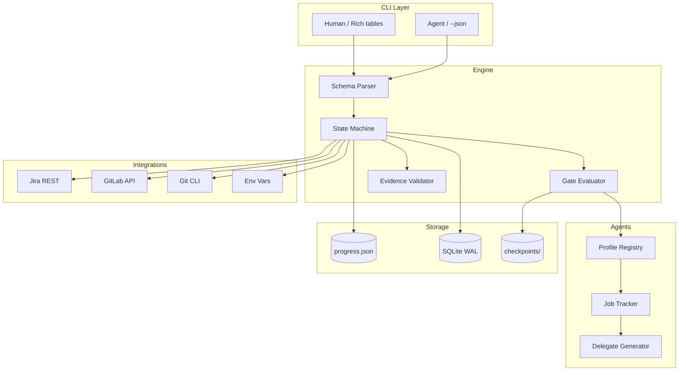

<!-- project-workflow-cli README — v3.0 2026 -->

<p align="center">
  
</p>

<p align="center">
  
  
  
  
  
</p>

<p align="center">
  <a href="#features"></a>
  <a href="#-cli-commands"></a>
  <a href="#-42-phase-workflow"></a>
  <a href="#-architecture"></a>
  <a href="#-quality-bar"></a>
</p>

---

<a name="features"></a>
## ✨ Features

| Feature | Description |
|---------|-------------|
| **Declarative Phases** | 42-phase workflow defined in `references/phases.yaml` — single source of truth |
| **Dual-Mode CLI** | Rich tables for humans, structured JSON for agents (`--json`) |
| **Gate Taxonomy** | 4 gate types: Pre-flight (PF), Revision (RV), Escalation (ES), Abort (AB) |
| **Rollback Engine** | Automatic rollback on gate failure with cycle tracking (max 3 retries) |
| **Parallel Delegation** | `delegate` / `delegate-batch` / `jobs` for multi-agent orchestration |
| **Evidence Tracking** | Mandatory evidence per phase: commands, test results, logs |
| **Context Budget** | 4-tier discipline for LLM context window management |
| **SQLite Migration** | Planned atomic state persistence with WAL mode |

---

## 📋 Requirements

- Python 3.11+
- Git, Jira access token (`JIRA_ACCESS_TOKEN`)
- GitLab access token (`GLAB_TOKEN`)

---

## 🚀 Quick Start

```bash
git clone https://github.com/FerrPOINT/project-workflow-cli.git
cd project-workflow-cli
python3 -m venv .venv
source .venv/bin/activate
pip install -e ".[dev]"
hrflow --help
```

---

<a name="-cli-commands"></a>
## 🖥️ CLI Commands

### Human Mode (Rich)
```bash
hrflow init TASK-123 "Implementation of auth system"
hrflow phase TASK-123 "3.0"
hrflow next TASK-123
hrflow status TASK-123
hrflow verify TASK-123
hrflow list-phases
hrflow playbook TASK-123 "7.6"
hrflow audit TASK-123
hrflow next-step TASK-123
hrflow rollback TASK-123 4.0 --reason "CriticGate BLOCKER: missing tests"
hrflow delegate TASK-123 reviewer
hrflow delegate-batch TASK-123 reviewer,qa
hrflow jobs
```

### Agent Mode (JSON)
```bash
hrflow --json init TASK-123 "Auth system"
hrflow --json next-step TASK-123
hrflow --json check-env
hrflow --json playbook TASK-123 "7.6"
hrflow --json rollback TASK-123 5.5 --reason "QA FAIL"
```

---

<a name="-42-phase-workflow"></a>
## 📋 42-Phase Workflow

| Group | Phases | Purpose | Gates |
|-------|--------|---------|-------|
| **Preflight** | 0.0–0.9 | Tool check, task intake, setup | PF (0.0), PF (0.5) |
| **Discovery** | 1.0–1.5 | Code discovery, deep research | CG-1 (self), CG-1.5 |
| **Plan** | 2.0–3.5 | Requirements, implementation plan | CG-2, CG-3 (BLOCKER) |
| **Develop** | 4.0–4.5 | TDD implement, pre-commit review | CG-4 (self), CG-4.5 (BLOCKER) |
| **Validate** | 5.0–5.5 | Compile, test, security scan, self-test | CG-5, CG-5.5 |
| **Commit** | 6.0 | Commit + push | CG-6 |
| **Review** | 7.0–7.7 | MR draft, code review, QA, Dataflow, CriticGate | CG-7.5, CG-7.6, CG-7.7 |
| **Done** | 8.0 | Jira transition, completion | — |
| **Improve** | 9.0–10.9 | Cleanup, retro, IP generation | CG-10 (self) |

**Core rules:**
- **Entry/Exit Ritual** — mandatory checklist at each phase boundary
- **Evidence Required** — concrete proof required (command output, test result, log file)
- **No Skip Allowed** — sequential execution only, no shortcuts
- **Max 3 Feedback Cycles** — cycle 4 escalates to human review

---

### Full Phase Map

```mermaid
%%{init: {'theme': 'dark', 'themeVariables': { 'primaryColor': '#06B6D4', 'edgeLabelBackground':'#1E293B', 'tertiaryColor': '#fff'}}}%%
flowchart TD
    subgraph G0["🚀 Preflight"]
        p00[0.0 Tool Check] --> p06[0.6 Team Setup]
        p06 --> p07[0.7 Repos Sync]
        p07 --> p08[0.8 Wiki Sync]
        p08 --> p09[0.9 PF CG-0.9]
        p09 --> p05[0.5 PF Jira In Progress]
    end

    subgraph G1[\"🔍 Discovery\"]
        p10[1.0 Context Load] --> p11[1.1 Code Discovery]
        p11 --> p12[1.2 Git History]
        p12 --> p13[1.3 Open MRs Check]
        p13 --> p14[1.4 Test Draft]
        p14 --> p15[1.5 PF Deep Research]
    end

    subgraph G2[\"📋 Plan\"]
        p20[2.0 Dataflow Map]
        p21[2.1 Code Archaeology]
        p22[2.2 API Verification]
        p23[2.3 Edge Cases]
        p24[2.4 Coverage Analysis]
        p25[2.5 MR Conflicts]
        p30[3.0 Plan Files/SQL]
        p32[3.2 Deps + MockSeed]
        p35[3.5 RV CG-Plan BLOCKER]
        p20 --> p30
        p21 --> p30
        p22 --> p32
        p23 --> p32
        p24 --> p32
        p25 --> p30
        p30 --> p32
        p32 --> p35
    end

    subgraph G4[\"💻 Develop\"]
        p40[4.0 Create Branch] --> p41[4.1 Tests RED]
        p41 --> p42[4.2 Code GREEN]
        p42 --> p43[4.3 Refactor]
        p43 --> p44[4.4 Lint Check]
        p44 --> p45[4.5 RV CG-PreCommit BLOCKER]
    end

    subgraph G5[\"✅ Validate\"]
        p50[5.0 Compilation] --> p51[5.1 Security Scan]
        p51 --> p52[5.2 Test Gate]
        p52 --> p53[5.3 Diff Sanity]
        p53 --> p54[5.4 Lint Gate]
        p54 --> p55[5.5 RV Self-Test]
    end

    subgraph G6[\"💾 Commit\"]
        p60[6.0 Commit Push] --> p61[6.1 CG-6]
    end

    subgraph G7[\"👁️ Review\"]
        p70[7.0 MR Draft] --> p71[7.1 Pipeline]
        p71 --> p72[7.2 Jira Link]
        p72 --> p75[7.5 RV Code Review]
        p75 --> p76[7.6 RV QA Test]
        p76 --> p76r[7.6R Dataflow Verify]
        p76r --> p77[7.7 RV CG-PostQA]
    end

    subgraph G8[\"🏁 Done\"]
        p80[8.0 Jira Done] --> p81[8.1 Report]
    end

    subgraph G10[\"📈 Improve\"]
        p90[9.0 Checkout Develop] --> p91[9.1 Delete Branch]
        p91 --> p92[9.2 Reset Hard]
        p92 --> p100[10.0 Retro]
        p100 --> p101[10.1 CG Audit]
        p101 --> p102[10.2 Generate IPs]
        p102 --> p103[10.3 Patch Skills]
        p103 --> p104[10.4 Bump Version]
    end

    p05 --> p10
    p15 --> p20
    p35 --> p40
    p45 --> p50
    p55 --> p60
    p61 --> p70
    p77 --> p80

    classDef preflight fill:#06B6D4,stroke:#0891B2,stroke-width:2px,color:#0B0F1A
    classDef discovery fill:#3B82F6,stroke:#2563EB,stroke-width:2px,color:#0B0F1A
    classDef plan fill:#F59E0B,stroke:#D97706,stroke-width:2px,color:#0B0F1A
    classDef dev fill:#EF4444,stroke:#DC2626,stroke-width:2px,color:#fff
    classDef validate fill:#10B981,stroke:#059669,stroke-width:2px,color:#0B0F1A
    classDef commit fill:#6366F1,stroke:#4F46E5,stroke-width:2px,color:#fff
    classDef review fill:#8B5CF6,stroke:#7C3AED,stroke-width:2px,color:#fff
    classDef done fill:#14B8A6,stroke:#0D9488,stroke-width:2px,color:#0B0F1A
    classDef improve fill:#EC4899,stroke:#DB2777,stroke-width:2px,color:#fff

    class p00,p06,p07,p08,p09,p05 preflight
    class p10,p11,p12,p13,p14,p15 discovery
    class p20,p21,p22,p23,p24,p25,p30,p32,p35 plan
    class p40,p41,p42,p43,p44,p45 dev
    class p50,p51,p52,p53,p54,p55 validate
    class p60,p61 commit
    class p70,p71,p72,p75,p76,p76r,p77 review
    class p80,p81 done
    class p90,p91,p92,p100,p101,p102,p103,p104 improve
```

---

### Color Map

| Group | Hex | Emoji |
|-------|-----|-------|
| Preflight | `#06B6D4` | 🚀 |
| Discovery | `#3B82F6` | 🔍 |
| Plan | `#F59E0B` | 📋 |
| Develop | `#EF4444` | 💻 |
| Validate | `#10B981` | ✅ |
| Commit | `#6366F1` | 💾 |
| Review | `#8B5CF6` | 👁️ |
| Done | `#14B8A6` | 🏁 |
| Improve | `#EC4899` | 📈 |

---

### Gate Legend

| Gate | Emoji | Meaning | FAIL Action |
|------|-------|---------|-------------|
| PF | 🔵 | Pre-flight Gate | Block entry, retry previous phase |
| RV | 🟡 | Revision Gate | Rollback to `rollback_target`, max 3 cycles |
| ES | 🟣 | Escalation Gate | Human review required (cycle > 3) |
| AB | 🔴 | Abort Gate | Immediate workflow halt |

---

<a name="-architecture"></a>
## 🏗️ Architecture



### Module Layout

```
wartz_workflow/
├── cli.py              # Click CLI with dual output (Rich + JSON)
├── config.py           # Constants, paths, API endpoints
├── state.py            # Task state (JSON → SQLite migration)
├── phases.py           # Phase management and checklists
├── schema.py           # YAML → dataclasses parser
├── engine.py           # Phase execution engine
├── verify.py           # verify-suite, .gitignore, tokens
├── jira_gitlab.py      # Jira + GitLab API integration
├── profiles.py         # Agent profile registry
├── jobs.py             # Background task tracking
├── rollback.py         # Rollback with cycle tracking
└── references/
    └── phases.yaml     # Declarative 42-phase schema

tests/
├── test_cli_integration.py
├── test_jobs.py
├── test_phases.py
├── test_profiles.py
├── test_rollback.py
├── test_state.py
└── test_verify.py
```

---

<a name="-quality-bar"></a>
## 🛡️ Quality Bar

| Metric | Target | Current |
|--------|--------|---------|
| Test Coverage | ≥ 80% | 47% |
| Passing Tests | 58/58 | ✅ |
| Lint | ruff + mypy | ✅ |
| CI Pipeline | pytest + ruff + mypy | Planned |
| Security Scan | Semgrep, Bandit | Planned |

```bash
# Run tests with coverage
pytest tests/ -v --cov=wartz_workflow --cov-report=term

# Run linting
ruff check wartz_workflow/
mypy wartz_workflow/
```

---

## 🎯 Roadmap

- [x] 42 declarative phases
- [x] Gate taxonomy (PF / RV / ES / AB)
- [x] Rollback engine with cycle tracking
- [x] Parallel delegation (`delegate`, `delegate-batch`, `jobs`)
- [ ] Coverage 47% → 80%
- [ ] Evidence validator YAML rules engine
- [ ] SQLite atomic persistence (WAL)
- [ ] Jira transition integration
- [ ] GitLab MR state checks
- [ ] Auto-delegate payload generation
- [ ] Audit report command

---

## 📫 Links

<p align="center">
  <a href="https://github.com/FerrPOINT"></a>
  <a href="https://t.me/ferrpoint"></a>
</p>

<p align="center">
  
</p>

---

<details>
<summary><b>Design Decisions</b></summary>

- **Python 3.11** — practical standard for CLI tools and backend automation. Click + Rich provide production-ready interfaces without overengineering.
- **YAML as single source of truth** — 42 phases defined declaratively, allowing workflow changes without code modifications.
- **Dual-mode CLI** — one command works for humans (Rich tables) and agents (JSON). Critical for AI-agent workflows.
- **Gate taxonomy** — four gate types with strict rules instead of arbitrary checkpoints: PF (pre-entry), RV (post-completion), ES (human escalation), AB (halt).
- **Evidence tracking** — every phase requires concrete proof (command output, test result, or log file). Prevents "looks fine" assumptions.
- **Native Hermes integration** — uses `delegate_task` directly instead of external frameworks (CrewAI / OpenAI Swarm) for full payload control.

</details>
