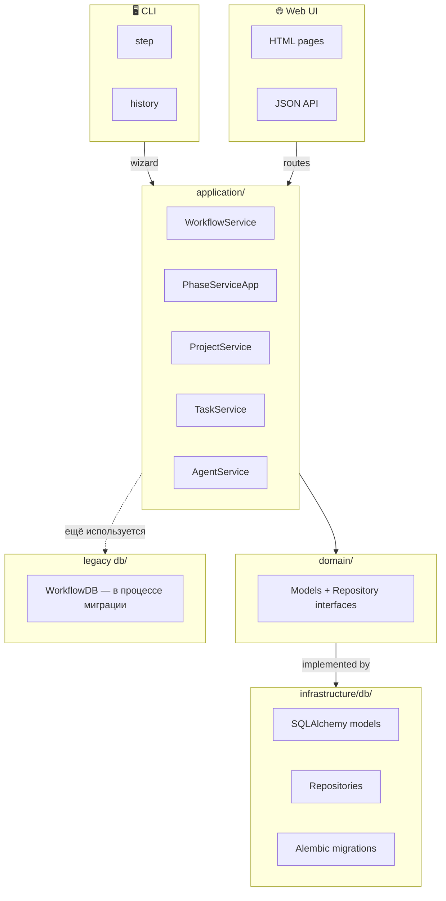
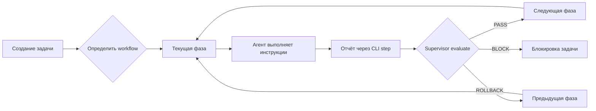

<p align="center">
  
</p>

<p align="center">
  <a href="#features"></a>
  <a href="#cli"></a>
  <a href="#ui"></a>
  <a href="#architecture"></a>
  <a href="#quality"></a>
</p>

<p align="center">
  
  
  
  
  
  
  
  
  
</p>

<p align="center">
  
  
  
</p>

---

## Позиционирование

**workflow-cli** — это пофазовый движок задач с жёстким контролем переходов.
Каждая задача проходит по заранее определённому workflow из фаз с инструкциями, чек-листами и артефактами.
CLI агент отчитывается текстом — supervisor оценивает отчёт и решает: PASS, ROLLBACK или BLOCK.
Всё управление workflow-шаблонами, фазами, проектами и агентами делается через веб-UI.

---

<a name="features"></a>
## ✨ Features

| Feature | Описание |
|---------|----------|
| **Жёсткий пофазовый workflow** | Каждая задача привязана к workflow; переходы контролируются `WizardEngine` + `PhaseFSM`. |
| **Двухкомандный CLI** | Только `step` и `history`. JSON-режим для автоматизации. |
| **Web UI** | 11 страниц: dashboard, phases, projects, workflows, agents, tasks, settings, skills. |
| **JSON API** | 23 endpoint для CRUD фаз, workflow, проектов, агентов и задач. |
| **TaskKeyValidator** | Валидация ключей задач по настраиваемым regex из `projects.key_patterns`. |
| **SMART evaluate** | Опциональная LLM-оценка отчёта (Ollama Cloud / local) с fallback на rule-based. |
| **Слои Clean Architecture** | `domain/` → `application/` → `infrastructure/` → `workflow_cli/ui/` / `cli/`. |
| **SQLite + Alembic** | Миграции, SQLAlchemy repositories, единый `WorkflowService` / `PhaseServiceApp`. |

---

<a name="cli"></a>
## 🖥️ CLI

> **Правило проекта:** в CLI ровно две команды — `step` и `history`.
> CRUD workflows / phases / projects / agents и администрирование выполняются через Web UI.
> Подробный план рефакторинга: [`docs/plans/2026-06-21-refactor-roadmap.md`](docs/plans/2026-06-21-refactor-roadmap.md).

### Установка

```bash
git clone https://github.com/FerrPOINT/project-workflow-cli.git
cd project-workflow-cli
python -m venv .venv
source .venv/bin/activate
pip install -e ".[dev,ui]"
```

### step

Показать текущую фазу или подать отчёт и перейти дальше:

```bash
workflow-cli step --task TASK-42
workflow-cli step --task TASK-42 --report "сделал X, проверил Y"
```

### history

История отчётов, переходов и статусов по задаче:

```bash
workflow-cli history --task TASK-42
workflow-cli history --task TASK-42 --n 50
```

### JSON-режим

```bash
workflow-cli --json step --task TASK-42 --report "..."
```

---

<a name="ui"></a>
## 🌐 Web UI

Запуск через systemd:

```bash
systemctl restart wartz-ui.service
```

Или вручную для разработки:

```bash
python -m workflow_cli.ui --host 0.0.0.0 --port 8811
```

### Страницы

| Страница | URL | Что делает |
|----------|-----|-----------|
| Dashboard | `/` | Сводка по задачам, фазам, агентам |
| Phases | `/phases` | Список фаз + порядок |
| Phase detail | `/phase/{phase_id}` | Инструкции, чеки, эвиденс |
| Tasks | `/tasks` | Список задач |
| Task detail | `/task/{task_key}` | История и текущая фаза |
| Projects | `/projects` | CRUD проектов + key patterns |
| Workflows | `/workflows` | CRUD workflow-шаблонов |
| Agents | `/agents` | CRUD агентов |
| Skills | `/skills` | Справочник скиллов |
| Settings | `/settings` | Read-only реестр CLI-команд |

### API

| Endpoint | Метод | Описание |
|----------|-------|----------|
| `/api/workflows` | GET / POST | Список / создание workflow |
| `/api/workflows/{id}` | PUT / DELETE | Обновление / удаление workflow |
| `/api/phases` | GET / POST | Список / создание фазы |
| `/api/phases/{id}` | GET / PUT / DELETE | Детали / обновление / удаление фазы |
| `/api/phases/order` | PUT | Изменение порядка фаз |
| `/api/projects` | GET / POST / PUT / DELETE | CRUD проектов |
| `/api/agents` | GET / POST / PUT / DELETE | CRUD агентов |
| `/api/tasks` | GET | Список задач |
| `/api/tasks/{task_key}` | GET | Детали задачи |
| `/api/skills` | GET | Каталог скиллов |
| `/api/settings` | GET | Настройки и CLI-реестр |

---

<a name="architecture"></a>
## 🏗️ Architecture



### Принципы

- **Application services** — единая точка входа для бизнес-логики.
- **Domain** не зависит от SQLAlchemy; `infrastructure/db/repositories.py` реализует интерфейсы из `domain/repositories.py`.
- **UI routes** только валидируют входные данные, вызывают сервисы и формируют ответ.
- **Raw SQL** допустим только в Alembic-миграциях.
- **Seed/sync default workflow** — явная операция, не side-effect при каждом запросе.

---

<a name="workflow"></a>
## 🔄 Жизненный цикл задачи



---

<a name="quality"></a>
## 🛡️ Quality Bar

| Контроль | Текущее состояние | Цель |
|----------|-------------------|------|
| Tests | **727 passed** | зелёный full suite |
| Lint | **ruff green** | сохранять green |
| Type check UI | **mypy workflow_cli/ui/ green** | mypy по всему `workflow_cli/` |
| Coverage | не измерялась | ≥ 90% |
| Raw SQL в production | 1 endpoint + legacy `db/base.py` | 0 вне миграций |

---

<a name="roadmap"></a>
## 🗺️ Roadmap

Подробный план: [`docs/plans/2026-06-21-refactor-roadmap.md`](docs/plans/2026-06-21-refactor-roadmap.md).

- [x] Разбить монолит `ui.py` на пакет `workflow_cli/ui/`
- [x] Внедрить Pydantic-схемы для API inputs
- [x] Добавить `workflow_cli/ui/__main__.py` для systemd
- [x] Довести `mypy workflow_cli/ui/` до зелёного
- [ ] Перевести UI routes с legacy `WorkflowDB` на application services
- [ ] Дополнить application services до полного CRUD
- [ ] Удалить / сузить `WorkflowDB` до Alembic-миграций
- [ ] Типизировать `wizard.py` и декомпозировать логику
- [ ] Добиться `mypy workflow_cli/ --ignore-missing-imports` green

---

## 📫 Links

<p align="center">
  <a href="https://github.com/FerrPOINT/project-workflow-cli"></a>
</p>

---

<p align="center">
  
</p>
