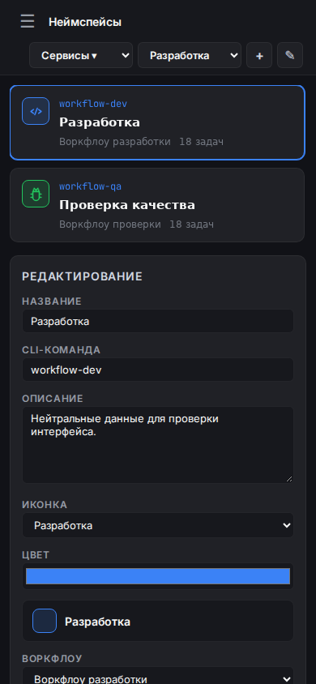

<p align="center">
  
</p>

<p align="center">
  <a href="#capabilities"></a>
  <a href="#quick-start"></a>
  <a href="#visual-proof"></a>
  <a href="#safety"></a>
  <a href="#quality"></a>
</p>

<p align="center">
  
  
  
  
  
</p>

> **Project Workflow** is a private, self-hosted control plane for phased tasks. An executor reports through the CLI; the mandatory Supervisor evaluates the report and records `PASS`, `ROLLBACK` or `BLOCK` against append-only phase history.

<a name="overview"></a>
## Overview

The PostgreSQL runtime is the source of truth for workflow templates, phases, namespaces, agents, tasks and Supervisor history. The FastAPI/Jinja2 UI owns workflow configuration and read-only task observation: `/task/{task_key}` (только наблюдение) and `/instructions?phase_id={phase_id}` expose context without bypassing the executor/Supervisor path. В UI доступен просмотр задач, а не их создание или продвижение. The public CLI stays deliberately compact around `step` and `history`.

| Surface | Current behavior | Boundary |
|---|---|---|
| Workflow | Manage templates, phases, instructions, checks and evidence requirements. | Phase decisions are Supervisor-gated and recorded in history. |
| Namespaces | Bind a workflow, UI identity and wrapper CLI command to an entry point. | A namespace changes task context; it does not create a separate hidden runtime. |
| Tasks | Observe state, phase history, checks, evidence and verdicts in the UI. | The UI does not create or advance tasks. |
| CLI | `step` creates/advances a task through its configured namespace; `history` reads its phase/Supervisor record. | User-facing wrapper commands remain thin namespace selectors over those operations. |
| Runtime bridge | Optional internal service-to-service `step` and `history` endpoints support isolated executors. | It is not a user UI API and requires configured runtime role tokens. |

<a name="capabilities"></a>
## Capabilities

- **Phased execution.** Define ordered and parallel workflow phases with instructions, checks, evidence requirements and rollback targets.
- **Mandatory Supervisor gate.** Every submitted report receives an auditable verdict: `PASS`, `ROLLBACK` or `BLOCK`.
- **Namespace isolation.** Give each entry point its own workflow, visual identity and configured wrapper command while keeping CLI semantics consistent.
- **Read-only task observation.** Inspect task state, history, checks, evidence and verdicts without bypassing the executor/Supervisor path.
- **PostgreSQL-first runtime.** Use SQLAlchemy and Alembic for the production runtime; SQLite is limited to isolated tests and screenshot smoke fixtures.

<a name="quick-start"></a>
## Quick Start

The repository Compose profile starts PostgreSQL, applies migrations/bootstrap data and exposes the UI/API only on loopback.

```bash
docker compose up --build -d --wait
curl --fail http://127.0.0.1:8812/health
```

The health response confirms the application, database and schema state. Repository Compose publishes PostgreSQL and API on loopback; deployment-specific OpenAI, platform-service and internal-runtime bridge settings are supplied through environment variables, never committed credentials.

For a local developer install, quality commands and the runtime environment, read [docs/quality-gate.md](docs/quality-gate.md), [docs/database-reset.md](docs/database-reset.md) and [AGENTS.md](AGENTS.md).

### CLI entry points

Install namespace wrappers from the active PostgreSQL catalog:

```bash
python scripts/install_namespace_clis.py --bin-dir ./.bin
workflow-run step --task RUN-123 --report "Сделал X, проверил Y"
workflow-run history --task RUN-123 --n 10
workflow-qa step --task RUN-42 --report "Проверил сценарии"
workflow-dev history --task RUN-42
```

The wrapper sets `PROJECT_WORKFLOW_NAMESPACE_ID` and invokes only the internal `step/history` CLI. The same external task key can therefore be tracked independently in separate namespaces.

<a name="visual-proof"></a>
## Visual Proof

The root README uses a neutral isolated fixture rather than the operational task dashboard. The fixture uses generic namespace names and UI-testing copy, without credentials, task keys, URLs or filesystem paths. The broader screenshot set and its capture process remain covered by [docs/quality-gate.md](docs/quality-gate.md).

### Namespace configuration

<figure>
  
  <figcaption>Namespace identity, workflow binding and wrapper-command configuration.</figcaption>
</figure>

### Namespace configuration on mobile

<figure>
  
  <figcaption>Mobile 390x844 evidence: cards stack and the editor remains a single-column form.</figcaption>
</figure>

<a name="safety"></a>
## Safety Boundaries

- **Authority split.** Executors submit reports through the CLI; Supervisor verdicts control phase progression. The UI is an observer for tasks rather than a manual advancement path.
- **Runtime isolation.** The internal runtime bridge is enabled only with `PROJECT_WORKFLOW_RUNTIME_TOKENS_JSON` and belongs on an internal network or host loopback.
- **Data boundary.** PostgreSQL is the runtime source of truth. SQLite exists only for isolated tests and screenshot fixtures, never as a replacement production state store.
- **Configuration boundary.** API credentials, runtime role tokens and external-provider settings are environment values; do not put them in README examples, committed files or screenshot evidence.
- **Network boundary.** This is an internal, loopback/private-contour utility. It intentionally does not claim public multi-tenant ingress, external-user security middleware or public observability scope.

<a name="quality"></a>
## Quality and Verification

| Gate | Command |
|---|---|
| Documentation regression checks | `pytest -q tests/test_docs_quality.py --timeout=60` |
| README assets and anchors | `python scripts/verify_readme.py` |
| Unit/UI tests | `pytest -q --timeout=60` |
| PostgreSQL integration | `pytest -q -m integration tests/test_postgres_integration.py --timeout=120` |
| Coverage | `pytest --cov=project_workflow --cov-report=term --timeout=60` |
| Lint and type checks | `ruff check .` and `mypy project_workflow scripts` |
| Compose readiness | `docker compose up --build -d --wait` and `curl --fail http://127.0.0.1:8812/health` |

`make quality` and `pwsh -File scripts/quality.ps1 quality` collect the documented local gates. GitHub Actions repeats unit/UI, PostgreSQL integration, coverage, lint, mypy, diff hygiene and Compose readiness for every push and pull request to `master`.

## Documentation Map

- **Product/runtime:** [docs/quality-gate.md](docs/quality-gate.md), [LIVE_TEST_PLAN.md](LIVE_TEST_PLAN.md), [docs/database-reset.md](docs/database-reset.md)
- **Architecture:** [project_workflow/interfaces/ui/app.py](project_workflow/interfaces/ui/app.py), [project_workflow/infrastructure/db/session.py](project_workflow/infrastructure/db/session.py), [project_workflow/interfaces/ui/routes/runtime_api.py](project_workflow/interfaces/ui/routes/runtime_api.py)
- **Repository conventions:** [AGENTS.md](AGENTS.md), [pyproject.toml](pyproject.toml), [.github/workflows/ci.yml](.github/workflows/ci.yml)

<a name="license"></a>
## License

FerrPOINT Proprietary Source-Available Evaluation License v1.0. This repository is not open source. Viewing and evaluation are allowed under [LICENSE](LICENSE); commercial, production, resale, redistribution and SaaS/hosting use require written FerrPOINT permission.
