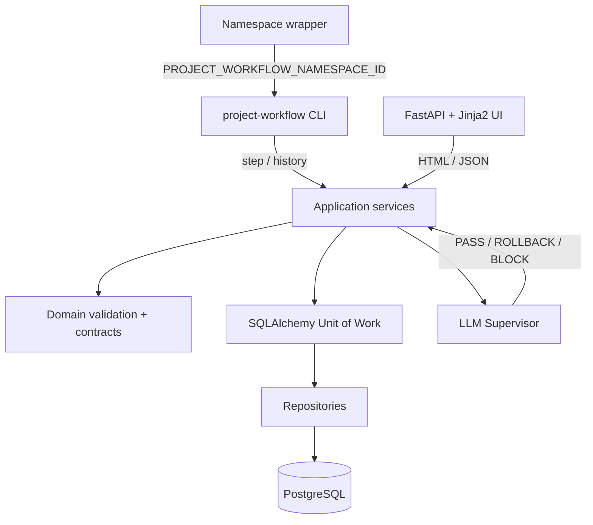

<p align="center">
  
</p>

<p align="center">
  <a href="#features"></a>
  <a href="#stack"></a>
  <a href="#cli"></a>
  <a href="#ui"></a>
  <a href="#architecture"></a>
  <a href="#quality"></a>
  <a href="#license"></a>
</p>

<p align="center">
  
  
  
  
  
  
  
  
  
</p>

<p align="center">
  
  
  
  
</p>

---

## 🎯 Позиционирование

**project-workflow** — внутренняя loopback/private платформа для пофазного ведения задач.
Агент отчитывается через CLI, обязательный LLM Supervisor проверяет отчет и переводит задачу по workflow.
Runtime-источник данных — **PostgreSQL**.

CLI намеренно остается маленьким: `step` и `history`. Управление workflow, фазами, namespaces, агентами и задачами живет в Web UI.

## 📌 Snapshot

| Поле | Значение |
|---|---|
| Статус | Internal `1.0.0` |
| Runtime | Docker Compose on `127.0.0.1`, PostgreSQL |
| UI/API | `http://127.0.0.1:8812` |
| CLI selector | `PROJECT_WORKFLOW_NAMESPACE_ID` |
| UI selector | `workflow_namespace_id`, query override `?namespace_id=` |
| License | FerrPOINT Proprietary Source-Available Evaluation License v1.0 |

<a name="features"></a>
## ✨ Features

| Feature | Описание |
|---|---|
| Phase workflow | Задача идет по шаблону фаз с инструкциями, checks, evidence и audit history. |
| Supervisor gate | Переход фазы проходит через обязательную оценку отчета. |
| Namespace runtime | Несколько entrypoints могут иметь свои workflow, задачи, стиль UI, key prefixes и CLI-команду. |
| Web UI | CRUD для workflows, phases, namespaces, agents и tasks. |
| Append-only history | История фаз и `step`-проверок не затирается. |
| CLI freeze | Публичный CLI остается управляемым и предсказуемым: `step` / `history`. |
| Wrapper commands | `workflow-qa`, `workflow-dev` и другие команды генерируются из записей PostgreSQL. |

<a name="stack"></a>
## 🔧 Core Stack

| Zone | Tech | Роль |
|---|---|---|
| Runtime | Python 3.10+ | application runtime and packaging target |
| Data | PostgreSQL | source of truth for UI, CLI and supervisor state |
| ORM | SQLAlchemy 2 | models, repositories, unit-of-work |
| Migrations | Alembic | schema history and baseline |
| API/UI | FastAPI + Jinja2 | server-side UI and JSON endpoints |
| Validation | Pydantic | settings, schemas and DTO boundaries |
| CLI | Click + Rich | compact agent-facing command surface |
| Quality | pytest, ruff, mypy | local quality gate |

<a name="cli"></a>
## 🖥️ CLI

```bash
project-workflow step --task RUN-123 --report "Сделал X, проверил Y"
project-workflow history --task RUN-123 --n 10
```

Generate namespace wrapper commands:

```bash
python scripts/install_namespace_clis.py --bin-dir ./.bin

workflow-qa step --task RUN-42 --report "Проверил сценарии"
workflow-dev history --task RUN-42
```

The wrapper sets `PROJECT_WORKFLOW_NAMESPACE_ID=<id>` and calls `project-workflow step/history`, so the same external task key can exist independently in different namespaces.

<a name="ui"></a>
## 🌐 Web UI

```bash
cp .env.example .env
docker compose up --build -d --wait
curl --fail http://127.0.0.1:8812/health
```

UI: `http://127.0.0.1:8812`.

Compose binds PostgreSQL and API to `127.0.0.1`. Before starting a fresh baseline over an old dev volume, follow [docs/database-reset.md](docs/database-reset.md).

| Area | Route |
|---|---|
| Dashboard | `/` |
| Namespaces | `/namespaces`, `/namespaces/new` |
| Tasks | `/tasks`, task detail |
| Phases | `/phases`, phase detail |
| Workflows | `/workflows` |
| Agents | `/agents` |

<a name="architecture"></a>
## 🏗️ Architecture


```mermaid
flowchart TD
    CLI[project-workflow CLI] -->|step / history| App[Application services]
    Wrap[Namespace wrapper] -->|PROJECT_WORKFLOW_NAMESPACE_ID| CLI
    UI[FastAPI + Jinja2 UI] -->|HTML / JSON| App
    App --> Domain[Domain validation + contracts]
    App --> UoW[SQLAlchemy Unit of Work]
    UoW --> Repo[Repositories]
    Repo --> DB[(PostgreSQL)]
    App --> Supervisor[LLM Supervisor]
    Supervisor -->|PASS / ROLLBACK / BLOCK| App
```

### Принципы

- Runtime state lives in PostgreSQL; code paths should not grow hidden in-memory truth.
- Domain validation stays outside SQLAlchemy models.
- UI routes validate requests, call application services and return HTML/API responses.
- Supervisor decisions are auditable and connected to phase history.
- Compatibility aliases stay only where current runtime still needs them.

<a name="quality"></a>
## 🛡️ Quality Bar

| Проверка | Команда |
|---|---|
| Full local gate | `make quality` |
| Warning-focused gate | `make warnings` |
| Compose readiness | `make compose-ready` |
| Windows quality | `pwsh -File scripts/quality.ps1 quality` |
| Windows readiness | `pwsh -File scripts/quality.ps1 compose-ready` |

`constraints.txt` pins the tested dependency set; Docker uses the same constraints.

## 🧭 Project Map

```text
project-workflow/
├── project_workflow/ # domain, application services, CLI, UI and supervisor
├── tests/            # unit, integration, UI and regression coverage
├── scripts/          # quality, DB init and namespace CLI helpers
├── docs/             # architecture, quality gate and bug audit
├── docker-compose.yml
├── pyproject.toml
└── constraints.txt
```

## 📚 Документы

- [docs/architecture.md](docs/architecture.md) — CLI/UI/Supervisor boundaries, state/audit model and runtime scope.
- [docs/quality-gate.md](docs/quality-gate.md) — local gate, PostgreSQL integration, Compose readiness and browser smoke.
- [docs/bug-audit.md](docs/bug-audit.md) — defect audit notes.
- [LIVE_TEST_PLAN.md](LIVE_TEST_PLAN.md) — executor-driven E2E acceptance.

<a name="license"></a>
## 🔒 License

Proprietary source-available. Not open source.

Viewing/evaluation only.

Commercial, production, resale, redistribution, SaaS/hosting use require written license from FerrPOINT. См. [LICENSE](LICENSE), [NOTICE](NOTICE) и [THIRD_PARTY_NOTICES.md](THIRD_PARTY_NOTICES.md).

<p align="center">
  
</p>
