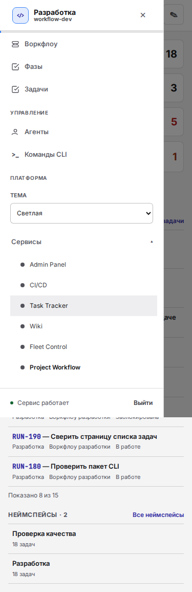
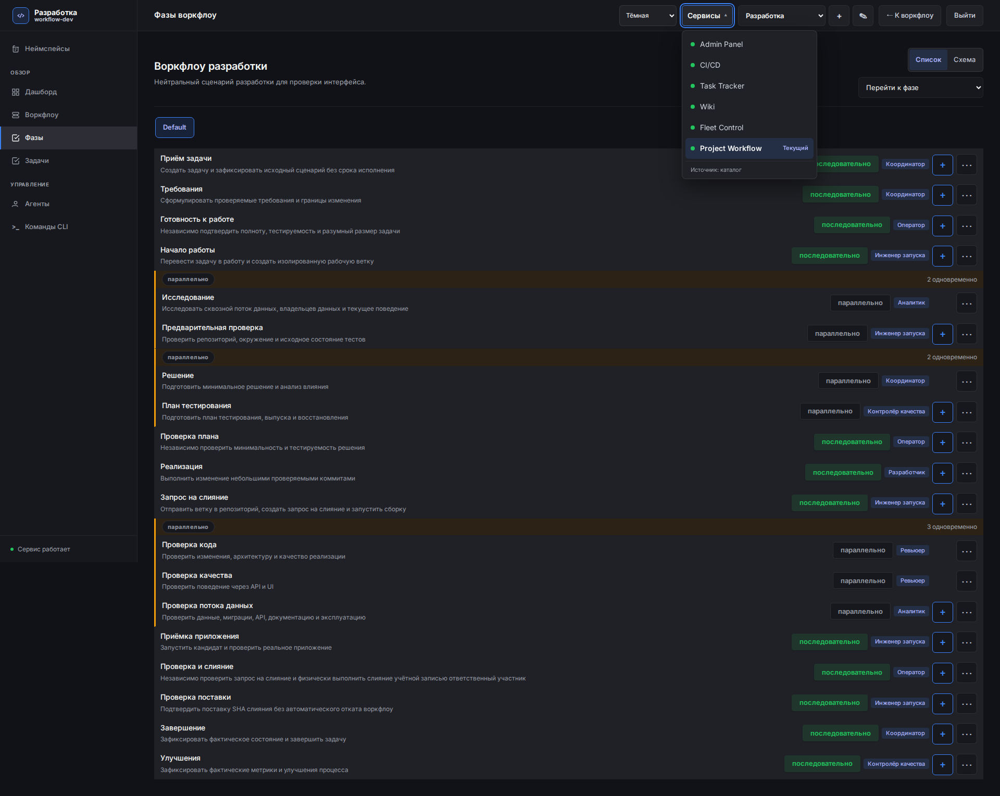

# Каталог Сервисов Workflow

Скриншоты текущего серверного UI на отдельной нейтральной SQLite smoke-базе
из `scripts/prepare_ui_smoke_data.py`. Приложение запущено с source mount;
это не evidence immutable production image или SSO-приёмки.

Браузерный regression прошёл 60 сочетаний: dashboard/phases, ширины
375/768/1280/1920/2560 px, dark/gray/light и два источника каталога.
Runtime читает настоящий каталог Admin Panel; fallback использует реальный
отказ подключения. API не перехватывались и не подменялись.

- Шесть UI, продуктовый порядок, один текущий Workflow, ссылки остальных пяти.
- В runtime health получен из каталога; в fallback все шесть unknown.
- Тема страницы и обоих существующих selectors совпадает.
- На mobile все шесть ссылок доступны после прокрутки drawer.
- Enter открывает desktop selector; Escape закрывает его или drawer и
  возвращает фокус на trigger.
- Menu-scoped axe: нет serious/critical violations. Нет page/console/network
  ошибок на проверенных страницах; screenshots full-page.

Текущие header/sidebar controls пока не заменены общим Base SSR Header.
Полная геометрия страниц, SSO и итоговый rollout проверяются отдельно.
